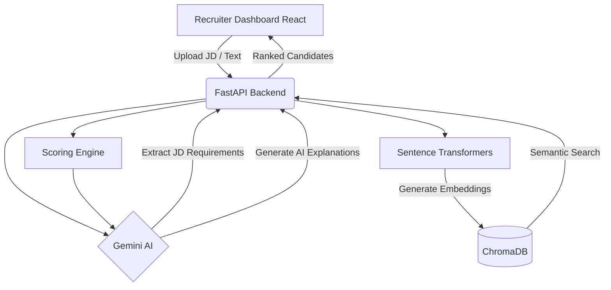

# AI Candidate Ranking System

The AI Candidate Ranking System is an intelligent recruitment platform that revolutionizes the hiring process by matching job descriptions with candidate profiles using state-of-the-art semantic search and LLM-powered evaluations.

## Problem Statement

Traditional keyword-based hiring is inefficient. It often filters out highly qualified candidates who use different terminology in their resumes, while passing through underqualified candidates who simply keyword-stuff. This system solves this by utilizing semantic AI-based ranking, which truly understands the meaning, context, and implied skills within both the job description and the candidate's experience, providing a much more accurate and fair evaluation.

## Features

- **AI Job Description Understanding**: Extract key requirements instantly using Gemini.
- **Semantic Candidate Search**: Deep matching beyond keywords using vector embeddings.
- **Hybrid Candidate Scoring**: Multi-faceted evaluation combining semantic similarity, skill matching, and experience.
- **Explainable AI Rankings**: Gemini generates clear, human-readable explanations for why a candidate was ranked highly.
- **ChromaDB Vector Search**: Lightning-fast retrieval of relevant candidate profiles.
- **Candidate Analytics Dashboard**: Visual insights into the talent pool.
- **Responsive React Dashboard**: A beautiful, interactive, and modern user interface.

## Tech Stack

**Frontend**
- React
- Vite
- Material UI (Icons)
- Recharts

**Backend**
- FastAPI
- Python

**AI**
- Gemini API
- Sentence Transformers
- BAAI/bge-large-en-v1.5
- ChromaDB

**Deployment** (Planned)
- Google Cloud Run
- Firebase Hosting

## Project Architecture



## Folder Structure

```
hack2skill_dataandaichallenge/
├── backend/
│   ├── api/
│   │   └── routes.py
│   ├── models/
│   │   └── schemas.py
│   ├── services/
│   │   ├── chroma_db.py
│   │   ├── llm_service.py
│   │   └── scoring_engine.py
│   ├── main.py
│   ├── requirements.txt
│   └── .env.example
├── frontend/
│   ├── src/
│   │   ├── components/
│   │   │   ├── Analytics/
│   │   │   ├── CandidateList/
│   │   │   ├── Dashboard/
│   │   │   ├── Background3D.jsx
│   │   │   └── Cursor.jsx
│   │   ├── context/
│   │   ├── pages/
│   │   ├── services/
│   │   │   └── api.js
│   │   ├── App.jsx
│   │   └── index.css
│   ├── package.json
│   └── vite.config.js
└── README.md
```

## Installation

### Backend

```bash
cd backend
python -m venv venv
# Windows: venv\Scripts\activate, Mac/Linux: source venv/bin/activate
pip install -r requirements.txt
```

### Frontend

```bash
cd frontend
npm install
```

## Running Locally

### Backend

```bash
cd backend
uvicorn main:app --reload
```

### Frontend

```bash
cd frontend
npm run dev
```

## Environment Variables

To run the AI features, you must configure your Gemini API key in the backend. Rename `backend/.env.example` to `backend/.env` and add:

`GEMINI_API_KEY`: Your Google Gemini API Key required for Job Description extraction and Candidate Explainability generation.

## API Endpoints

- `POST /api/jobs/upload`: Accepts a JD string, uses Gemini to extract requirements, searches ChromaDB for matches, scores candidates, generates explanations, and returns a ranked list.
- `GET /api/database/stats`: Retrieves statistics on the currently indexed candidates in the database.

## Screenshots

- **Landing Page** (Placeholder)
- **Recruiter Dashboard** (Placeholder)
- **Candidate Ranking** (Placeholder)
- **Analytics Dashboard** (Placeholder)
- **Candidate Details** (Placeholder)

## Future Improvements

- Authentication (OAuth/JWT)
- PostgreSQL Integration for persistent user data
- Redis Caching for faster repeated queries
- Multi-company / Tenant support
- Resume Parsing (PDF/DOCX) extraction pipeline
- Cloud Deployment (GCP / AWS)

## License

MIT
